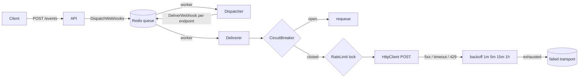

# Async Rate-Limited Webhook Engine

Compact Symfony microservice that accepts domain events over HTTP and delivers webhooks asynchronously with production-grade resilience: circuit breaking, fixed-delay retries + DLQ, and per-endpoint concurrency limits.

## Architecture



## Quick start

```bash
docker compose up --build
```

Accept an event (returns immediately with `202`):

```bash
curl -sS -X POST http://localhost:8080/events \
  -H 'Content-Type: application/json' \
  -d '{"event":"OrderPlaced","payload":{"order_id":"42"}}'
```

Workers consume `async` (and `failed` for DLQ inspection) via Symfony Messenger + Redis.

Endpoint list lives in [`config/packages/webhook.yaml`](config/packages/webhook.yaml) (defaults point at `https://httpbin.org/post` for a working smoke test).

Inspect the dead-letter queue with:

```bash
docker compose exec worker php bin/console messenger:consume failed -vv --limit=10
```

## Engineering decisions

1. **Why a circuit breaker?** When a client endpoint fails repeatedly (default: 50 consecutive errors), Redis marks the circuit open for 60s. Workers stop hammering a dead host, which keeps the queue healthy for everyone else. After the open window, the next attempt is a half-open probe.
2. **How are 5xx / timeouts handled?** `WebhookHttpClient` throws a retryable `WebhookDeliveryException`. Messenger uses a fixed delay strategy (`1m → 5m → 15m → 1h`). After four failures the message lands on the `failed` transport (DLQ) and `FailedWebhookLogger` records a critical log. Non-retryable 4xx responses are acknowledged and dropped (bad URL/payload should not loop forever).
3. **Why concurrency limits?** A Redis semaphore (`max_concurrent: 2` per endpoint) prevents a burst of workers from stampeding one customer and earning a `429` ban. If the slot is full, delivery fails fast and retries with backoff.
4. **Why Messenger + Redis instead of inline HTTP?** `POST /events` only enqueues work. HTTP latency of downstream clients never blocks the API; workers scale independently (`docker compose up --scale worker=3`).

## Quality gates

```bash
composer phpstan   # level 9
composer test      # PHPUnit unit + integration
```

GitHub Actions runs both on every push/PR (`.github/workflows/ci.yml`).

## Stack

- PHP 8.4+ / Symfony 7.4
- FrankenPHP (Caddy) + Redis
- Symfony Messenger, HttpClient, Monolog
- PHPStan 9, PHPUnit
