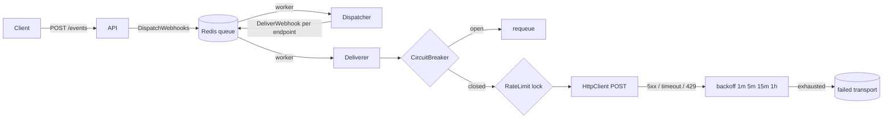

# Async Rate-Limited Webhook Engine

Compact Symfony microservice that accepts domain events over HTTP and delivers webhooks asynchronously with production-grade resilience: circuit breaking, fixed-delay retries + DLQ, and per-endpoint concurrency limits.

## Architecture



## Quick start

```bash
docker compose up --build
```

Accept an event (returns immediately with `202`):

```bash
curl -sS -X POST http://localhost:8080/events \
  -H 'Content-Type: application/json' \
  -H 'X-Api-Key: change-me-in-real-deployments' \
  -d '{"event":"OrderPlaced","payload":{"order_id":"42"}}'
```

Workers consume `async` via Symfony Messenger + Redis. Set `API_KEY` in Compose/env for production.

Endpoint list is configured via `WEBHOOK_ENDPOINTS` (JSON). Defaults point at `https://httpbin.org/post`; the e2e overlay points at the local `receiver` service.

Inspect the dead-letter queue with:

```bash
docker compose exec worker php bin/console messenger:consume failed -vv --limit=10
```

## Engineering decisions

1. **Why a circuit breaker?** When a client endpoint fails repeatedly (default: 50 consecutive errors), Redis marks the circuit open for 60s. After the window expires, a single half-open probe is allowed (`SET NX`); other workers stay blocked until that probe succeeds or fails.
2. **How are 5xx / timeouts handled?** `WebhookHttpClient` throws a retryable `WebhookDeliveryException`. Messenger uses a fixed delay strategy (`1m → 5m → 15m → 1h`). After four failures the message lands on the `failed` transport (DLQ) and `FailedWebhookLogger` records a critical log. Non-retryable 4xx responses are acknowledged and dropped.
3. **Why concurrency limits?** An atomic Redis Lua semaphore (`max_concurrent: 2` per endpoint) prevents a burst of workers from stampeding one customer and earning a `429` ban. Acquire is a single EVAL round-trip so INCR/EXPIRE/cap cannot race.
4. **Why Messenger + Redis instead of inline HTTP?** `POST /events` only enqueues work (after `X-Api-Key` auth). HTTP latency of downstream clients never blocks the API; workers scale independently (`docker compose up --scale worker=3`).

## Quality gates

```bash
composer phpstan   # level 9
composer test      # PHPUnit unit + integration
```

### E2E (live Compose stack) and k6

```bash
# Full organism test: API → Redis → worker → local receiver
./scripts/e2e.sh

# Or keep the stack up and run load afterwards
docker compose -f docker-compose.yml -f docker-compose.e2e.yml up -d --build
MANAGED_STACK=1 ./scripts/e2e.sh
./scripts/k6.sh
docker compose -f docker-compose.yml -f docker-compose.e2e.yml down
```

GitHub Actions runs PHPStan/PHPUnit and the Compose e2e + k6 job on every push/PR.

## Stack

- PHP 8.4+ / Symfony 7.4
- FrankenPHP (Caddy) + Redis
- Symfony Messenger, HttpClient, Monolog
- PHPStan 9, PHPUnit, k6
